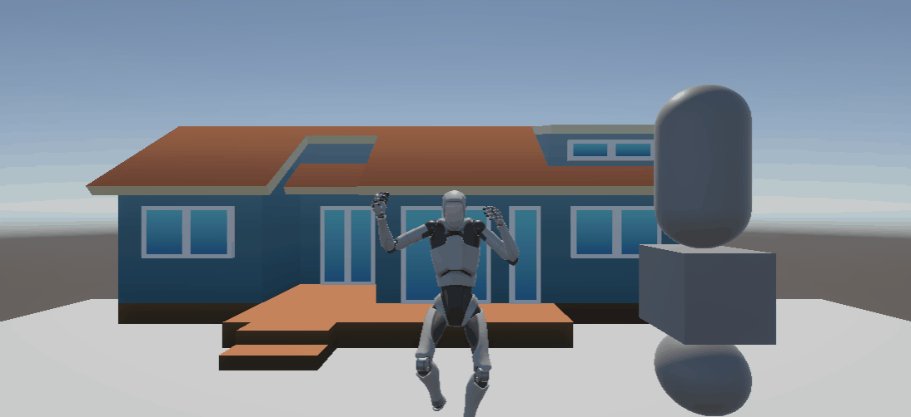

# Práctica Unity 1 - Escena 3D básica

## Descripción

Este proyecto contiene una escena 3D creada en Unity.

Incluye:

- Terreno y objetos 3D básicos (cube, sphere, capsule).
- Prefab de los **Starter Assets** (Third Person Controller).
- Un asset gratuito importado desde la Asset Store.
- Script `LogObjectsInfo.cs` que muestra en la consola la etiqueta y posición de cada objeto.

## Demostración

## Estructura

- `Assets/Scripts/LogObjectsInfo.cs` → Script de logging.
- `Assets/StarterAssets/` → Prefabs y assets importados.
- `Assets/Palmov Island/` → Asset libre de la Asset Store.
- `Assets/Scenes/Introducción a Unity.unity` → Escena configurada.
